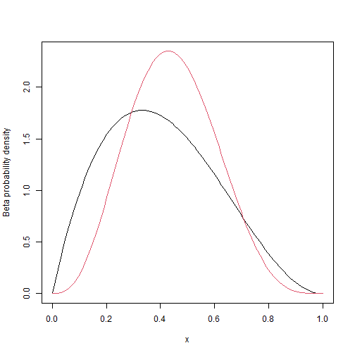

Final Project Summary
========================================================
author: Wei Qiao
date: 1/1/2021
autosize: true

Outlines
========================================================
- the useful information on how to Deploy the application on Rstudio's shiny server
- My Shiny app r code
- The github account: wqiaogithub


How to deploy the application on Rstudio's shiny server
========================================================

- sign up in Shinyapps.io: website is http://www.shinyapps.io
- use the following sample R code:
https://docs.rstudio.com/shinyapps.io/getting-started.html#deploying-a-sample-application

install.packages('rsconnect')
library(rsconnect)
deployApp()


rsconnect::setAccountInfo(name="<ACCOUNT>", token="<TOKEN>", secret="<SECRET>")


R Code
========================================================


```r
pbetaineq <- function(alpha1,beta1,alpha2,beta2) {
    fb <- function(x){x**(alpha1-1) * (1-x)**(beta1-1) * pbeta(x,alpha2,beta2) / beta(alpha1,beta1)}
   res <- integrate(fb,0,1)
   res$value
  }
pbetaineq(2,3,4,5)
```

```
[1] 0.4242424
```

Beta distribution ( beta (2,3) & beta (4,5) ) plot
========================================================


